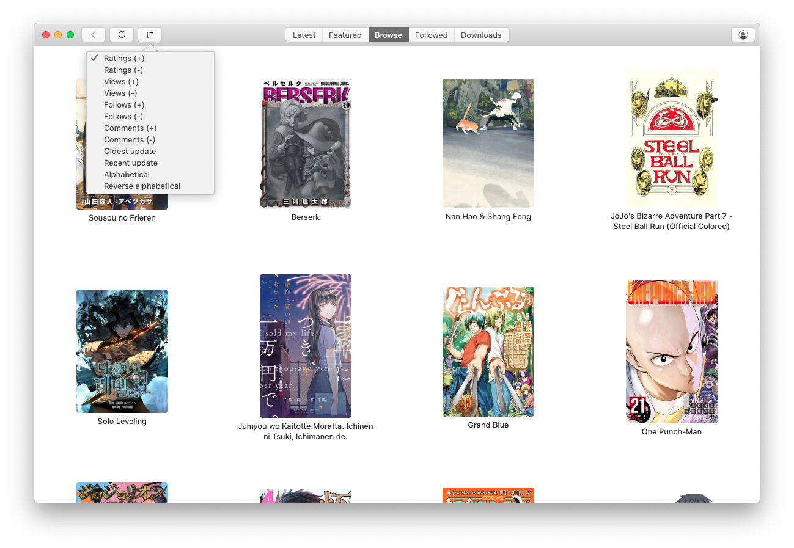
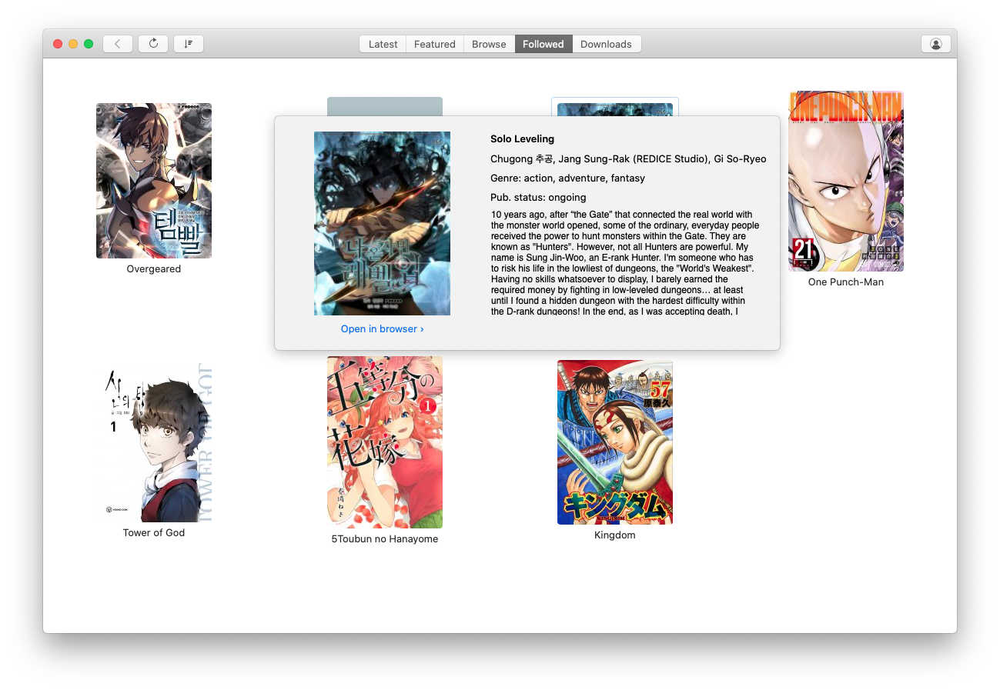
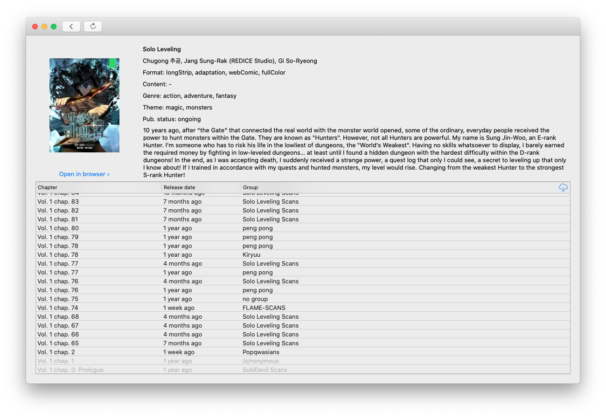

<p align="center" >
  
</p>

Kitsune is a macOS client for [MangaDex](https://mangadex.org), built using [MangaDexLib](https://github.com/JRomainG/MangaDexLib), to browse, read, and download your favorite mangas.

## Features

<table style="border: none">
  <tr style="border: none">
    <td style="border: none"></td>
    <td style="border: none"></td>
  </tr>
  <tr style="border: none">
    <td style="border: none"></td>
    <td style="border: none"></td>
  </tr>
</table>

* Browse latest, featured or full list of mangas,
* Login using your MangaDex account to manage followed mangas and save your reading progress,
* Read mangas, in long-strip format or not, directly from the app,
* Download chapters to read them offline.

## Installing

Simple grab the latest version from the [release page](https://github.com/JRomainG/Kitsune-macOS/releases).

## Development

To install, simply checkout the `dev` branch of this repository:

```bash
git clone https://github.com/JRomainG/Kitsune-macOS.git
git checkout dev
```

You will then be able to open the `Kitsune-macOS.xcodeproj` project. Swift's package manager should automatically download both [SwiftSoup](https://github.com/scinfu/SwiftSoup) and [MangaDexLib](https://github.com/JRomainG/MangaDexLib). Don't forget to change the team and signing certificate before building.

This project uses [SwiftLint](https://github.com/realm/SwiftLint) to enforce Swift style and conventions.

## Contributing

If you found a bug, or would like to see a new feature added, feel free to open an issue on the Github page. Pull requests are welcome!

If you can, also consider [supporting MangaDex](https://mangadex.org/support) and the team behind the website.

## License

The project is available under the [GPLv3](https://www.gnu.org/licenses/gpl-3.0.en.html) license.

## Disclaimer

This project is not affiliated with the [MangaDex](https://mangadex.org/) website, and is independently developed.
